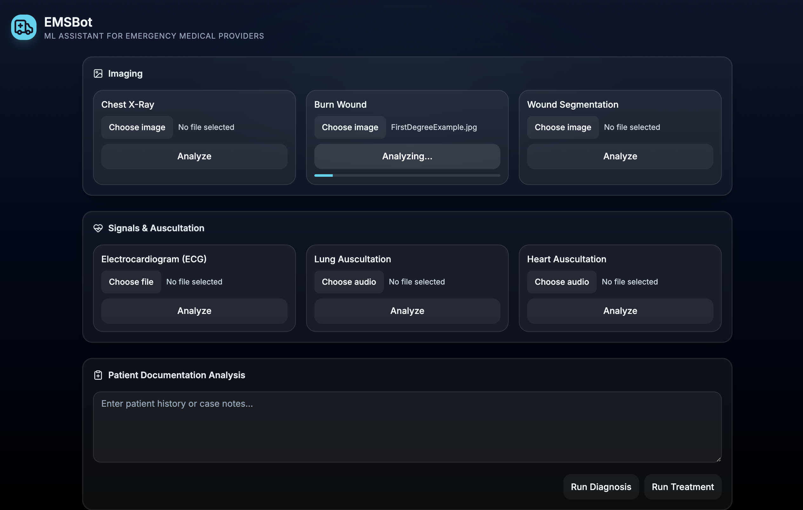
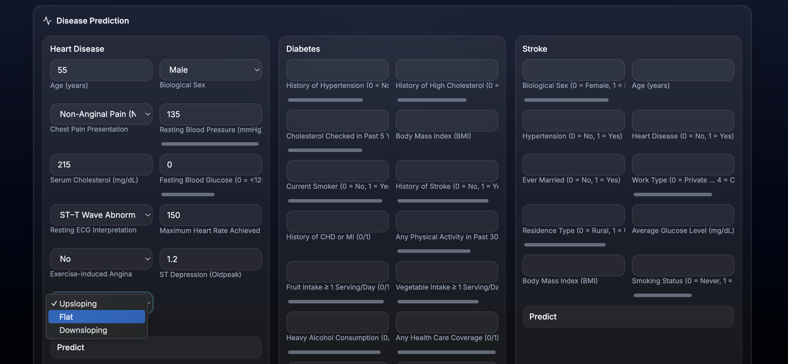
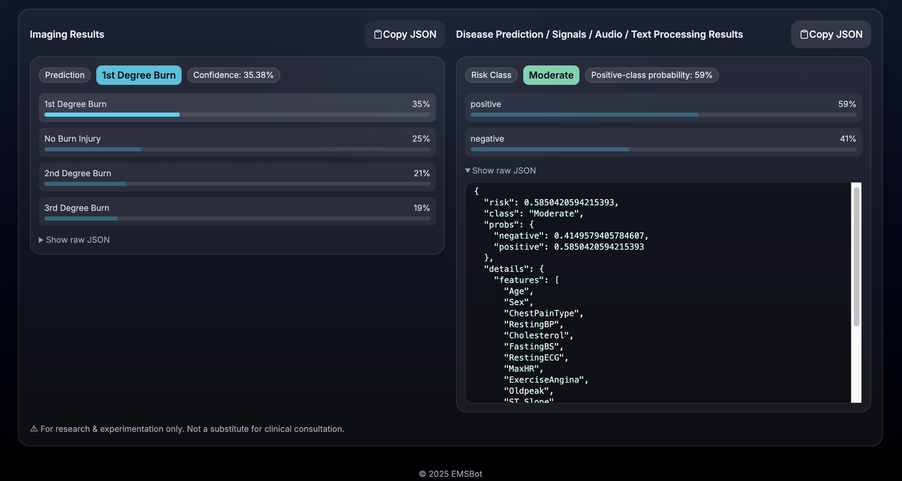
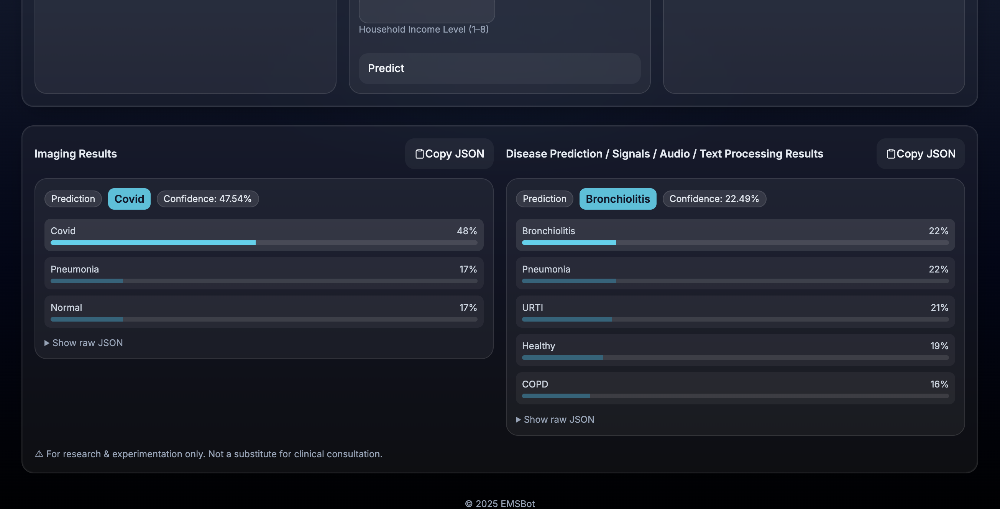

# EMSBot

EMSBot is a full-stack clinical prototyping tool built for emergency medical providers, integrating diverse machine learning capabilities into a single, streamlined interface.


## Contents

- [Machine Learning](#machine-learning)
- [Architecture](#architecture)
- [Setup](#setup)
  - [Backend](#backend)
  - [Frontend](#frontend)
- [Artifacts & Preprocessing](#artifacts--preprocessing)
- [API Reference](#api-reference)
- [Demo](#demo)
- [In Progress](#in-progress)
- [Disclaimer](#disclaimer)

## Machine Learning

### Models

- Burn Injury Image Classifier
- Chest X-Ray Image Classifier
- Heart Disease Prediction
- Diabetes Prediction
- Stroke Prediction
- Lung Auscultation Diagnosis
- Heart Auscultation Diagnosis
- Electrocardiogram (ECG) Classification
- Medical Report Text Processors (two classification models: Diagnosis & Treatment)
- Wound Image Segmentation

### Algorithms Used

- Neural networks (CNN/RNN/GRU/LSTM pipelines where applicable)
- Logistic Regression
- Random Forest Ensembles
- Gradient Boosting
- Decision Trees

### Technologies

- **Backend/Model Training**: Python, FastAPI, TensorFlow/Keras, NumPy, Pandas, Matplotlib, SciPy, scikit-learn, seaborn, imbalanced-learn, librosa, Pillow
- **Frontend**: Next.js (App Router), React, TypeScript, Tailwind CSS

## Architecture

```
EMSBot/
├── model_training/
│   ├── BurnInjuryClassifer.ipynb
│   ├── ChestXRayClassifier.ipynb
│   ├── LungAuscultationDiagnosis.ipynb
│   ├── HeartFailurePrediction.ipynb
│   ├── DiabetesPrediction.ipynb
│   ├── StrokePrediction.ipynb
│   ├── MedicalReportsTextProcesser.ipynb
│   ├── HeartAuscultationDiagnosis.ipynb    #In progress
│   ├── ElectrocardiogramClassifier.ipynb   #In progress
│   ├── WoundSegmentation.ipynb             #In progress
├── frontend/
│   ├── app/
│   │   ├── layout.tsx
│   │   └── page.tsx
│   ├── src/
│   │   ├── components/
│   │   │   ├── ImagingCard.tsx
│   │   │   ├── ReportProcessor.tsx
│   │   │   ├── RiskPanel.tsx
│   │   │   ├── ResultsPane.tsx
│   │   │   └── FilePicker.tsx
│   │   ├── config/
│   │   │   └── riskSchemas.ts
│   │   ├── hooks/
│   │   │   └── useUploader.ts
│   │   └── services/
│   │       └── api.ts
│   ├── styles/
│   │   └── globals.css
│   ├── tailwind.config.cjs
│   ├── postcss.config.cjs
└── emsbot-api/
    ├── app/
    │   ├── main.py
    │   ├── deps.py
    │   ├── models/
    │   │   ├── loader.py
    │   │   └── preprocess.py
    │   └── routers/
    │       ├── vision.py         # cxr-classify, burn-classify, wound-segmentation
    │       ├── audio.py          # lung-dx, heart-dx
    │       ├── risk.py           # heart-failure, diabetes, stroke
    │       └── nlp.py            # diagnosis, treatment
    │       └── signals.py        # ecg-classify
    ├── artifacts/                # SavedModels + JSON stats
    │   ├── cxr_classifier/...
    │   ├── burn_classifier/...
    │   ├── lung_ausc_diagnosis/...
    │   ├── heart_failure_prediction/...
    │   ├── diabetes_prediction/...
    │   ├── stroke_prediction/...
    │   ├── text_diagnosis/...
    │   ├── text_treatment/...
    │   ├── heart_failure_prediction_scaler.json
    │   ├── diabetes_prediction_scaler.json
    │   ├── stroke_prediction_scaler.json
    └── requirements.txt
```

## Setup

### Backend

#### Prereqs

- Python 3.10+
- TensorFlow 2.15.x

#### Install

```bash
cd emsbot-api
python -m venv .venv && source .venv/bin/activate  # or conda env
pip install -r app/requirements.txt
```

#### Run

```bash
uvicorn app.main:app --reload --port 8000
```

#### Expected routes

- `/api/vision/cxr-classify`
- `/api/vision/burn-classify`
- `/api/vision/wound-segmentation`   (501 placeholder)
- `/api/audio/lung-dx`
- `/api/audio/heart-dx`              (501 placeholder)
- `/api/signals/ecg-classify`        (501 placeholder)
- `/api/risk/heart-failure`
- `/api/risk/diabetes`
- `/api/risk/stroke`
- `/api/nlp/diagnosis`
- `/api/nlp/treatment`

### Frontend

#### Prereqs

- Node 18+ / 20+
- npm or yarn

#### Install

```bash
cd frontend
npm install
```

#### Run

```bash
npm run dev
# open http://localhost:3000
```


## Artifacts & Preprocessing

SavedModel directories go into `emsbot-api/artifacts/`:

- `cxr_classifier/`, `burn_classifier/`, `lung_ausc_diagnosis/`,
- `heart_failure_prediction/`, `diabetes_prediction/`, `stroke_prediction/`,
- `text_diagnosis/`, `text_treatment/`

**Scaler stats** — exported from notebooks for exact training-time standardization:

- `heart_failure_prediction_scaler.json`
- `diabetes_prediction_scaler.json`
- `stroke_prediction_scaler.json`

### Backend Input Preprocessing

- **Vision**: Resize to model's expected size (CXR 256×256, Burn 180×180), scale to [0,1], apply softmax on outputs.
- **Audio**: Decode audio → resample 16 kHz → 52 MFCCs → mean over time → shape (1, 1, 52).
- **Heart risk**: Build the exact 20-dim vector after one-hotting (Sex, ChestPainType, RestingECG, ExerciseAngina, ST_Slope) in notebook order, then per-column z-score using scaler JSON.
- **Diabetes/Stroke**: Per-column z-score using their scaler JSONs.

## API Reference

### Vision(Imaging)

**POST `/api/vision/cxr-classify`**

- **Body**: multipart/form-data with `image` (file, image/*)
- **Response**:
  ```json
  {
    "prediction": "Normal",
    "confidence_pct": 92.18,
    "probs": { "Normal": 0.9218, "Pneumonia": 0.0611, "Covid": 0.0171 },
    "meta": { "ts": 1755320187, "engine": "tensorflow.keras" }
  }
  ```

**POST `/api/vision/burn-classify`** — same shape.

**POST `/api/vision/wound-segmentation`** → 501 Not Implemented.

### Audio(Ausculation)

**POST `/api/audio/lung-dx`**

- **Body**: multipart/form-data with `audio` (file, audio/*)
- **Response**:
  ```json
  {
    "prediction": "HEALTHY",
    "confidence_pct": 78.42,
    "probs": {
      "COPD": 0.03, "Bronchiolitis": 0.05, "Pneumonia": 0.06, "URTI": 0.08, "Healthy": 0.78
    },
    "meta": { "ts": 1755320187, "engine": "tensorflow.keras" }
  }
  ```

**POST `/api/audio/heart-dx`** → 501 Not Implemented.

### Signals

**POST `/api/signals/ecg-classify`** → 501 Not Implemented.

### Disease Prediction

**POST `/api/risk/heart-failure`**

- **Body**: JSON with 11 raw fields:
  ```json
  {
    "Age": 55, "Sex": "M",
    "ChestPainType": "NAP",
    "RestingBP": 135, "Cholesterol": 220, "FastingBS": 0,
    "RestingECG": "Normal", "MaxHR": 145, "ExerciseAngina": "N",
    "Oldpeak": 1.0, "ST_Slope": "Flat"
  }
  ```

Backend builds the 20-dim feature vector, scales per column, and returns:
```json
{
  "risk": 0.43,
  "class": "moderate",
  "probs": { "negative": 0.57, "positive": 0.43 },
  "details": { "features": ["Age","Sex", "..."] },
  "meta": { "ts": 1755313961, "engine": "tensorflow.keras" }
}
```

- **POST `/api/risk/diabetes`** — 21 numeric/coded fields (BRFSS); same response shape (risk, class, probs).
- **POST `/api/risk/stroke`** — 10 fields (Kaggle stroke); same response shape.

### Clinical Text Processing

Both endpoints accept either multipart/form-data (FormData) or JSON:

- **Form field**: `text`
- **JSON**: `{ "text": "..." }`

**POST `/api/nlp/diagnosis`**

- **Response**:
  ```json
  {
    "task": "diagnosis",
    "prediction": "Respiratory System",
    "probs": { "...": 0.03, "Respiratory System": 0.08, "...": 0.02 },
    "diagnoses": ["Respiratory System"],
    "meta": { "ts": 1755323764, "engine": "tensorflow.keras" }
  }
  ```

**POST `/api/nlp/treatment`**

- **Response**:
  ```json
  {
    "task": "treatment",
    "prediction": "Pain Management",
    "probs": { "...": 0.03, "Pain Management": 0.05, "...": 0.02 },
    "medications": ["Pain Management"],
    "meta": { "ts": 1755323800, "engine": "tensorflow.keras" }
  }
  ```

## Demo

Below are demo screenshots showcasing EMSBot in action:









 (If the images appear blurry in this preview, please click on them to view in full resolution)

## In Progress...

### Implement:
- Wound image segmentation
- Heart auscultation classifier
- ECG classifier

-Calibrate probability outputs (Platt/temperature scaling where useful).

-Export and use class label JSONs for all models.

### Packaging:
- Dockerfile(s) for frontend + backend
- Optional GPU build

## Disclaimer

This project is currently intended for experimental and research purposes only. It is not a substitute for professional medical advice.